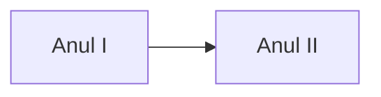
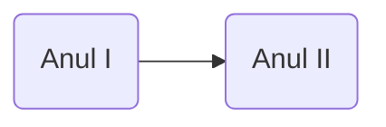
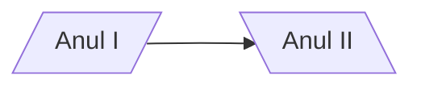
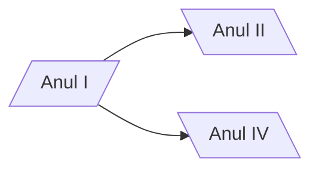
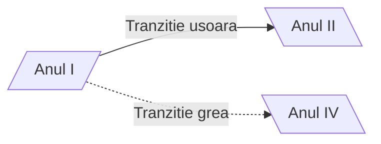
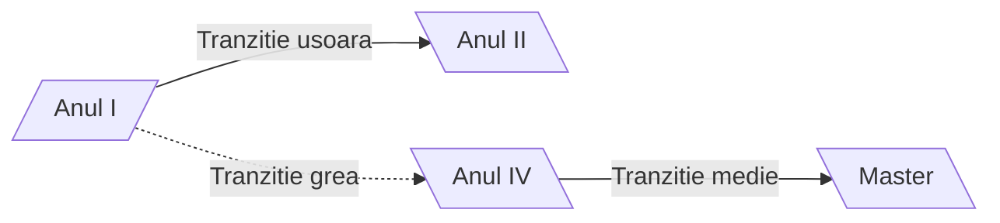

<script id="MathJax-script" async src="https://cdn.jsdelivr.net/npm/mathjax@3/es5/tex-mml-chtml.js"></script>


[Homepage](index.md)

# Diagrame de tip _Flowchart_













**De retinut**
- Diagramele _floucharte_ au _noduri_ si _conectori_
- Nodurile au
   - **forma** (data de parantezele folosite la descrierea _nodului_)
   - ID (sirul folosit in afara descrierii nodului)
   - Descriere (textul ce apare in caseta nodului si care este implementat in interiorul diferitelor diferitelor tipuri de paranteze -ce decid forma casetei nodului)
 - Conectorii au:
   - Diferite tipuri de sageti sau chiar pot activa fara sageti
   - Diferite tipuri de linii
       -`-->` linie continua (stanga dreapta)
       -`<--` linie continua (dreapta stanga)
       -`<-->` linie continua (sageata stanga si dreapta)
       -`==>` linie ingrosat cu sageata spre dreapta


 flowchart LR
```mermaid
 a & b --> c & d & e --> f & g
```

# Diagrama de tip _Timelife_ in mermaid live

timeline
title "my timeline"
section "sectiunea 1"
2023-2024
            : am luat la facultate 
            : am luat contact cu mediul academic
2024-2025
            : am termina anul 1
            : am facut practica 
section "sectiunea 2"
2025-2026
            : am facut practica la Fotogrametrie
2026-2027
            : am anul terminal IV
        : am terminat facultatea  
